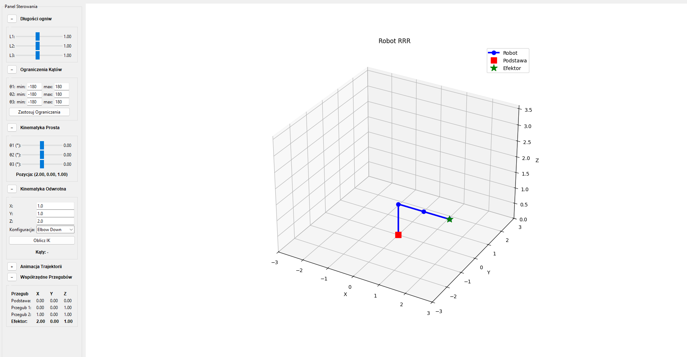
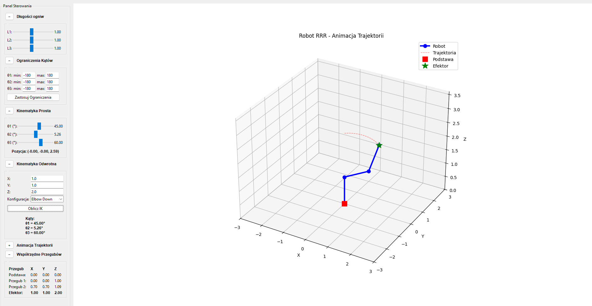

# RRR Manipulator Simulator

A simple desktop simulator for a 3-DOF RRR robot manipulator.
The project provides forward and inverse kinematics, joint limit controls, link-length tuning, and a trajectory animation preview — all inside an interactive Tkinter GUI with a 3D Matplotlib visualization.

## Key features

- Interactive 3D visualization of an RRR robot.
- Forward kinematics (FK): change joint angles with sliders and see end-effector position.
- Inverse kinematics (IK): compute joint angles for a desired (X, Y, Z) target (Elbow Up / Elbow Down options).
- Joint angle limits that can be applied to the sliders and IK checks.
- Adjustable link lengths (L1, L2, L3) in the GUI.
- Trajectory generation and animation between current and target joint configurations.

## Requirements

- Python 3.8+ (Windows recommended for bundled Tkinter).
- Python packages:
  - numpy
  - matplotlib

## Installation

1. Create and activate a virtual environment (optional but recommended):

```powershell
python -m venv .venv
.\.venv\Scripts\Activate.ps1
```

2. Install required Python packages:

```powershell
pip install numpy matplotlib
```

## Usage

Run the GUI:

```powershell
python rrr.py
```

The GUI provides the following controls (labels are in Polish in the app):

- Link lengths (L1, L2, L3): sliders to adjust link lengths and immediately update the visualization.
- Joint angle sliders (θ1, θ2, θ3): change the robot pose and view the resulting end-effector position.
- Angle limits: set min/max for each joint and apply them to limit the sliders and IK results.
- Inverse kinematics (X, Y, Z): enter a desired Cartesian position and press "Oblicz IK" to compute joint angles. Choose "Elbow Up" or "Elbow Down" configuration.
- Trajectory / Animation: provide target joint angles (θ1, θ2, θ3) or use IK to compute targets, then start animation to interpolate between current and target angles.

During FK/IK updates the GUI displays joint coordinates and the end-effector coordinates.

## Examples

- Compute IK for point (1.0, 1.0, 2.0): open the IK section, set X=1.0, Y=1.0, Z=2.0, pick configuration, press "Oblicz IK". If reachable, the computed angles will appear and an animation will run showing the interpolated motion.
- Animate to angles θ1=90°, θ2=45°, θ3=30°: open the Trajectory panel, fill the values, press "Start Animacji".

### Screenshots

Here I present the appearance of the application and its GUI.



Trajectory example:



## Code overview

- `RobotRRR` class: implements
  - `forward_kinematics(theta1, theta2, theta3)` -> joint positions and end-effector (x,y,z)
  - `inverse_kinematics(x, y, z, elbow_up=False)` -> (theta1, theta2, theta3) in degrees, or `None` if unreachable
  - `generate_trajectory(start_angles, end_angles, steps=50)` -> list of intermediate joint poses
- `RobotGUI` class: Tkinter GUI wiring, plotting (Matplotlib 3D), event handling, and animation.

